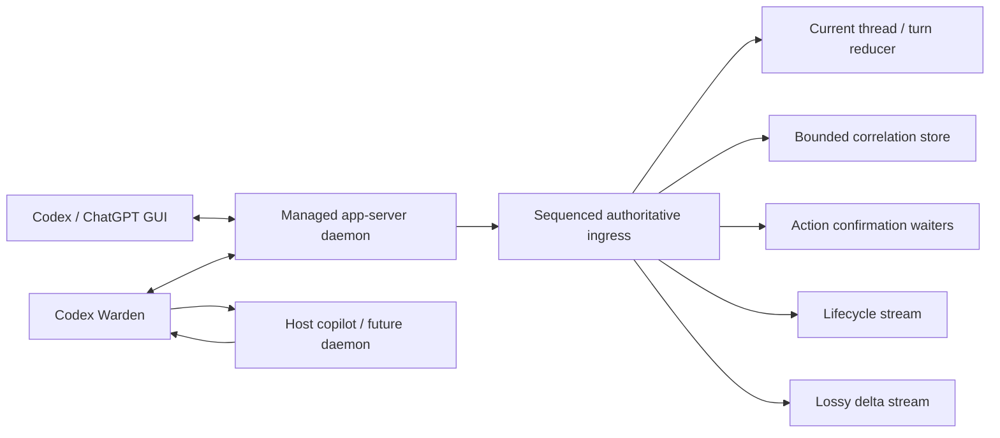

# Codex Warden

**Make live Codex Desktop threads observable and controllable from Rust.**

Codex Warden is an embeddable Rust control plane for software that cooperates with a
person using the Codex GUI. It joins the same managed app-server daemon as the GUI, so a
host application can:

- observe live thread, turn, item, and hook lifecycle events;
- retain a bounded, queryable window of recent Codex activity;
- build watcher agents that react to Codex activity or external signals;
- start, steer, or interrupt an explicitly selected turn; and
- keep the normal Codex Desktop interface at the center of the workflow.

It is a library, not a standalone daemon or a prebuilt watcher. Another Rust package
embeds it and supplies the long-running process, trigger, policy, or user-facing
copilot.

## What this makes possible

A host can watch a live Desktop turn, correlate it with an external event, and then
intervene against the exact thread and turn. Examples include:

- a test or deployment watcher that steers a running turn when new evidence arrives;
- a safety monitor that interrupts a known runaway turn;
- an ambient copilot that surfaces status without replacing the GUI; and
- a local daemon that reuses existing Codex automation against Desktop-owned work.

Codex Warden also passes through lifecycle notifications such as `hook/started` and
`hook/completed`, so embedded consumers can observe hooks already running in the shared
session. It does **not** currently install or mutate Codex hook definitions at runtime.
Mid-turn intervention is provided through `turn/steer` and `turn/interrupt`, not through
dynamic hook injection.

## Why this exists

The Codex GUI is not incidental. It is where the user reads the conversation, reviews
work, approves sensitive operations, redirects the agent, and remains the center of the
task. Software built with this package should therefore act as a **copilot beside the
GUI**, not as a replacement for it.

A useful embedded consumer might correlate Codex activity with another local signal,
surface ambient status, suggest a steering message, or interrupt a known runaway turn.
The user can keep working normally in the app while the embedded consumer observes the
same shared session.

That motivation drives the safety model:

- Observation does not grant bulk authority. Every action names an explicit thread and,
  when applicable, an explicit turn.
- The library never answers approval, elicitation, or reviewer requests and never takes
  the GUI's reviewer role.
- A request that may have been written is not blindly retried. Ambiguity is returned to
  the caller as `OutcomeUnknown`.
- Interrupt confirmation is correlation, not a claim of causation; a simultaneous GUI
  interrupt is indistinguishable on the wire.
- GUI shutdown is graceful only. The supervisor never force-kills a stubborn GUI by
  default, and library shutdown leaves the shared daemon running for the GUI.

## Scope

- macOS;
- one local user;
- the managed Codex app-server daemon;
- in-memory observation and correlation rather than durable storage;
- explicit `turn/start`, `turn/steer`, and `turn/interrupt` control;
- coexistence with the Codex/ChatGPT GUI.

This is not a multi-user service, a durable event database, a message broker, or an
approval bot.

## Runtime model

The GUI and the embedded consumer are peers on one local daemon. The library does not
scrape the interface or spawn a competing private Codex engine.



The authoritative order is important:

1. The transport assigns every inbound frame a monotonically increasing receipt
   sequence.
2. The reducer, event store, and action waiters process it.
3. Only then is the event published to consumer streams.

A slow stream consumer can therefore lose notification delivery without corrupting the
library's current state or action confirmation.

## Embedding the library

Once this repository is available to Cargo, depend on the `codex-control` package:

```toml
[dependencies]
codex-control = { git = "https://github.com/RPD123-byte/CodexWarden", package = "codex-control" }
serde_json = "1"
```

The central lifecycle API runs the host closure concurrently with all background loops:

```rust,no_run
use codex_control::{ActionOutcome, CodexControl, Config, LifecycleItem};

#[tokio::main]
async fn main() -> Result<(), Box<dyn std::error::Error>> {
    CodexControl::run(Config::default(), |handle| async move {
        let mut lifecycle = handle.lifecycle(0);

        while let LifecycleItem::Event(event) = lifecycle.recv().await {
            if event.method() == Some("turn/started") {
                println!("turn started: {:?}", event.turn_id);
            }
        }

        // Actions always use a target chosen by the host application.
        let outcome = handle.interrupt("thread-id", "turn-id").await;
        if let ActionOutcome::OutcomeUnknown { evidence, .. } = outcome {
            eprintln!("action remained ambiguous: {}", evidence.note);
        }
    })
    .await?;

    Ok(())
}
```

See [`src/core/examples/embedded.rs`](src/core/examples/embedded.rs) for a complete mock-backed
example. Returning from the closure or calling `handle.shutdown().await` performs graceful
cleanup.

## Observation: two consumer planes, one authoritative core

The two streams serve different consumers; they are not two equally reliable queues.

### Lifecycle plane

`handle.lifecycle(after_sequence)` carries state transitions such as thread creation,
status changes, turn start/completion, item lifecycle, and errors.

- Broadcast buffer: 1,024 events by default.
- Authoritative replay log: 4,096 lifecycle events by default.
- When a receiver lags, `LifecycleStream` replays retained transitions after its last
  sequence.
- If the requested sequence is older than the replay log, the stream returns
  `GapTooOld` with a current reducer snapshot. Current truth is recovered, but missing
  historical transitions are reported honestly.

Use this plane when correctness depends on knowing whether a thread or turn is active.

### Delta plane

`handle.deltas()` carries high-volume, cosmetic updates such as streamed message,
reasoning, diff, and process-output deltas.

- Broadcast buffer: 2,048 events by default.
- Delivery is explicitly lossy under backpressure.
- `DeltaStream::dropped()` reports how many events that receiver skipped.

Use this plane for live presentation and short-horizon texture, never as the source of
truth for lifecycle or action outcomes.

## Storage and retention

The event store is an in-memory correlation window, not the durable Codex history. Codex
already persists its own rollout data; this package keeps only enough recent, ordered
context for a host application to correlate external observations with Codex activity.

Both lifecycle and delta events enter the same store before stream fan-out. The default
policy is:

| Parameter | Default | Meaning |
| --- | ---: | --- |
| Raw event retention | 10 minutes | Events older than the moving monotonic window are removed. |
| Per-thread hard cap | 8 MiB | A single noisy thread cannot consume the whole store. |
| Global hard cap | 64 MiB | Total retained event memory remains bounded. |
| Timestamp tolerance | 2 seconds | Time queries tolerate daemon/receipt clock skew. |
| Ordering key | Receipt sequence | Ordering remains stable even if wall-clock time moves. |

When a byte cap is exceeded, older delta records are evicted before lifecycle records.
Queries return `RetentionGap` metadata describing summarized/evicted content instead of
pretending the requested history is complete.

This creates two effective horizons, but not two configured time windows:

- deltas have the shorter practical horizon because their consumer stream is lossy and
  they are evicted first under memory pressure;
- lifecycle data has the longer practical horizon because it also has a dedicated
  4,096-transition replay log and is removed after deltas when the store is pressured.

### When is a thread stale?

There is deliberately no single `thread_stale_after` timer.

- Idle, non-subscribed reducer entries are pruned immediately; global status noise does
  not accumulate authoritative thread state.
- Threads with an active turn are retained.
- Successful non-ephemeral daemon subscriptions are retained by default, even while
  idle, because releasing them could miss a short reactivation.
- Idle subscription release is available only when both
  `release_idle_subscriptions` and `reactivation_verified` are enabled after a live
  second-client reactivation check.
- Stored event content ages out according to the independent 10-minute/byte-cap policy.

So “thread relevance,” “subscription lifetime,” and “event-content retention” are three
different decisions rather than one stale timeout.

## Discovery and subscription behavior

The library discovers work from multiple signals:

- global `thread/started` notifications;
- global active `thread/status/changed` notifications;
- bounded reconciliation on connect and reconnect.

Reconciliation requests up to four pages of 50 threads (200 candidates), ordered by
recent update time, and reads/subscribes only active candidates. Subscription setup is
deduplicated per thread, retries the rollout-write race up to eight times with a 250 ms
delay, and has a default cap of 512 retained subscriptions. Reaching the cap reports
`CapacityDegraded` rather than silently pretending observation is complete.

Immediately after `thread/resume`, the library performs `thread/read { includeTurns:
true }`. If a turn began during the subscribe boundary, the reducer adopts it and the
store records a clearly marked reconstructed anchor rather than fabricating a wire
notification.

## Actions

The `Handle` exposes three explicit actions:

- `start(thread_id, input)` starts a turn on a selected thread;
- `steer(thread_id, expected_turn_id, input)` adds guidance with a turn precondition;
- `interrupt(thread_id, turn_id)` requests interruption of one selected turn.

Actions targeting the same thread are serialized within this client. They may still race
with the human using the GUI, so every result is explicit:

- `Confirmed` — the daemon accepted the request or unique matching evidence was
  observed, according to that action's contract;
- `Rejected` — the daemon rejected it or the transport proved it could not proceed;
- `OutcomeUnknown` — the write may have happened, but no unique evidence can safely
  distinguish success from a concurrent GUI action.

Defaults allow two retries only for requests proven `NotWritten`, separated by 100 ms.
Written-but-unanswered `start` and `steer` requests are never automatically resent. The
interrupt evidence window is three seconds, followed by conservative reconciliation.

## GUI and daemon supervision

`Config::manage_gui` defaults to `true`. On startup the supervisor:

1. verifies the standalone Codex installation;
2. attaches to an existing managed daemon or starts one only when none exists;
3. checks daemon/GUI compatibility;
4. preserves a GUI already attached in daemon mode;
5. otherwise requests a graceful quit and launches the GUI with
   `CODEX_APP_SERVER_USE_LOCAL_DAEMON=1`;
6. continues monitoring daemon and GUI health.

Set `manage_gui = false` when a test, another owner, or an embedding application already
manages the environment.

Transport defaults are a 3-second connect timeout, 30-second read-idle probe threshold,
15-second request timeout, and exponential reconnect delay from 100 ms to 5 seconds.
Action traffic remains gated until post-reconnect reconciliation completes.

## Public handle surface

In addition to actions, `Handle` provides:

- `lifecycle(after_sequence)` and `deltas()`;
- `events_since(sequence)` and `snapshot()` for lifecycle recovery;
- `query_sequence(...)` and `query_time(...)` for retained correlation data;
- `health()` and `supervision()`;
- `subscription_states()`;
- `shutdown()`.

## Protocol maintenance

Protocol types are generated from a pinned Codex JSON Schema snapshot in
`src/protocol/schema/`. Normal CI regenerates with the exact pinned Codex version and
fails on differences; a scheduled workflow reports drift from the latest release.

The protocol crate owns a compact sanitized fixture of representative inner messages
derived from captured traffic. The Rust workspace imports nothing from
`experimentation/`. Unknown method-bearing messages fall back to a raw envelope so a new
upstream method is sequenced and retained without crashing the connection.

## Repository layout

- `src/` — all Rust implementation crates, schemas, examples, and crate-local tests;
- `experimentation/` — isolated historical JavaScript spikes and local captures; never
  imported by the Rust workspace;
- `openspec/` — design artifacts and behavioral specifications;
- `tooling/openspec/` — isolated, optional Node installation for the pinned OpenSpec CLI;
- `scripts/` — schema and repository maintenance tooling;

Generated local directories are intentionally untracked:

- `target/` is Cargo's compiled output and incremental build cache. It can become large
  and is always safe to delete; Cargo recreates it.
- `tooling/openspec/node_modules/` contains the optional OpenSpec CLI installation. The
  Rust library does not use it; npm recreates it when specification authoring is needed.
- `experimentation/node_modules/` contains only dependencies for the isolated JavaScript
  probes. It is never used by the Rust workspace.
- large app bundles, logs, and raw traffic captures under `experimentation/` remain local.

## Build and verify

Requirements: Rust 1.91+, the pinned standalone Codex version for schema verification,
and macOS for live GUI supervision.

```sh
cargo build --workspace --all-targets
cargo test --workspace
cargo fmt --all -- --check
cargo clippy --workspace --all-targets -- -D warnings
./scripts/regenerate-schema.sh
```

Optional OpenSpec authoring setup:

```sh
npm ci --prefix tooling/openspec
npm run --prefix tooling/openspec openspec:validate
```

`cargo run -p codex-control --example live_status_spike` performs the documented live
second-client reactivation check without starting a turn. Live examples require the
managed daemon and should be run deliberately because they interact with real sessions.
